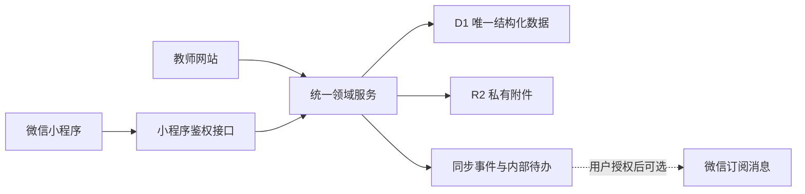
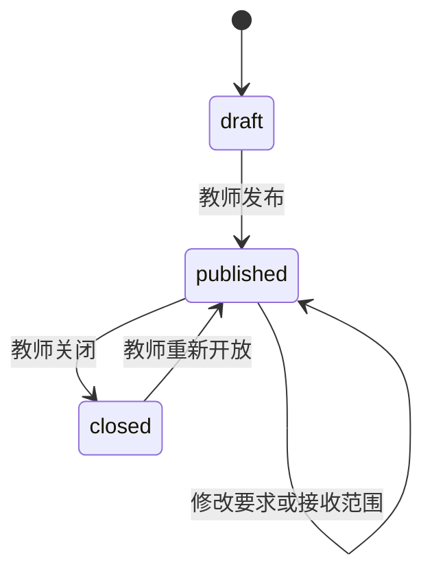
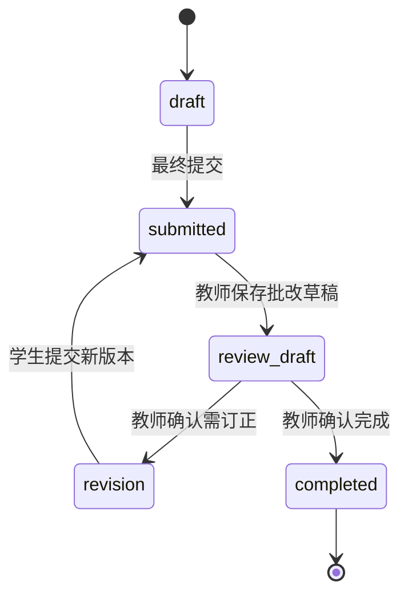

# 微信小程序与网站统一业务架构

更新基线：版本 27 / `12ee65e`
适用范围：本地候选版本；未经莫老师确认不得部署生产或提交微信审核。

## 1. 目标与边界

网站是教师管理、批改和正式确认的主入口。微信小程序只提供学生、家长和教师适合移动端的操作。两端共用 Cloudflare D1 和 R2，不维护第二套业务数据库。

- D1：作业、接收对象、提交版本、批改、绑定、同步事件、提醒状态的唯一结构化数据源。
- R2：试卷、图片、语音、视频、PDF、Word 等私有文件的唯一文件源。
- 小程序本地：仅保存会话、当前孩子、界面偏好、未提交草稿、待重试操作和最近同步游标。
- 微信服务：负责身份 code 换取和用户授权后的订阅提醒；提醒失败不改变业务状态。
- OCR：当前保持 `manual`，未经费用和隐私确认不发送真实学生资料给第三方。

## 2. 统一领域服务

网站接口和 `/api/mini/*` 不各自复制 SQL 规则，统一使用：

- `assignment-service.ts`：接收范围、发布、列表、统计、附件归属和同步事件。
- `submission-service.ts`：提交草稿、最终提交、订正版、版本号、幂等和附件关联。
- `mini-binding-service.ts`：账号状态、邀请码绑定申请、教师确认、停用和可访问学生。
- `mini-sync-service.ts`：服务端游标、首次全量、增量事件和撤销标记。
- `review-service.ts`：批改草稿、最终确认、订正状态和学情回流边界。

服务端是权限判断的唯一可信位置。客户端传入的角色、学生 ID、文件 ID 和状态均需重新校验。

## 3. 身份、绑定与会话

### 正式登录

`wx.login` 获取临时 code，服务端使用保密变量 `WECHAT_APP_ID` 与 `WECHAT_APP_SECRET` 换取 openid，再签发只保存哈希的站内会话。AppSecret、openid 和会话令牌不得写入日志或返回无关页面。

### 测试登录

仅当 `WECHAT_TEST_MODE=true` 且运行环境不是生产环境时接受 `testCode`。生产环境即使误配测试开关，也拒绝测试登录。无 AppID 时只表述为开发者工具测试，不表述为正式微信登录。

### 绑定流程

1. 教师网站选择学生和身份，生成一次性邀请码；数据库只保存邀请码哈希。
2. 学生或家长输入邀请码，形成 `pending` 绑定申请，不立即获得学生数据。
3. 教师在网站确认后变为 `active`；拒绝或停用后为 `rejected` / `disabled`。
4. 旧会话每次访问都会重新读取有效绑定，因此停用后立即失去该学生权限。
5. 一个家长可绑定多个学生，一个学生可有多位家长。

`GET /api/mini/me` 返回角色、绑定状态、可访问学生、当前学生、教师网站账号关联状态、会话过期时间和功能开关。

## 4. 作业生命周期

作业可面向一个班级或指定学生。接收范围保存在 `assignment_targets`，旧数据继续兼容 `assignments.class_id`。指定学生作业不能仅依靠班级关系判断权限。

## 5. 提交、订正与批改

- 首次提交和每次订正均生成递增版本，旧版本不可覆盖。
- 批改草稿只对教师可见；确认后才同步分数、标签、评语和订正要求。
- 只有教师确认的题目级结果才可进入错题、知识证据和月度报告。
- 政治快捷标签：观点不准确、材料对应不足、政治术语不规范、答题层次不清、采分点缺失。

## 6. 文件状态和失败恢复

上传到 R2 后同时建立 `file_leases`：

- `temporary`：上传成功但尚未关联最终业务记录；保留到期时间。
- `linked`：已关联作业或提交版本，不得按孤立文件清理。
- `cleanup`：超过保留期且无任何业务引用，可由后续受控任务清理。

最终提交失败时保留文字、操作 ID、已上传文件 ID 和本地临时引用。重试同一 `operationId` 返回首次成功结果，不增加版本。任何自动清理都只能标记候选，不能在本轮直接删除 R2 对象。

## 7. 增量同步

`GET /api/mini/sync?cursor=<server-sequence>` 返回当前账号有权访问的变化。游标来自 `sync_events.id`，不使用客户端时间作为唯一依据。

事件至少包含：事件类型、实体类型、实体 ID、目标角色/学生/账号、发生时间、撤销标记和最小负载。首次没有游标时返回账号可见的当前快照和最新游标；之后返回增量事件。页面进入、下拉刷新和轻量轮询复用同一接口，不引入 WebSocket。

## 8. 幂等策略

以下写操作要求稳定 `operationId`：发布作业、最终提交、创建订正版、确认批改、发布反馈、发布优秀作业和提醒入队。

`idempotency_operations` 以“执行主体 + 动作 + operationId”唯一。成功后保存最小结果 JSON；重复请求直接返回原结果。冲突中的请求不能生成第二条业务记录。

## 9. 权限矩阵

| 能力 | 教师网站 | 小程序教师 | 学生 | 家长 |
| --- | --- | --- | --- | --- |
| 创建/发布作业 | 是 | 快速发布 | 否 | 否 |
| 查看作业 | 全工作区 | 全工作区 | 仅本人接收 | 仅有效绑定孩子 |
| 提交 | 否 | 否 | 仅本人 | 仅允许代交的绑定孩子 |
| 批改草稿/确认 | 是 | 是 | 否 | 否 |
| 查看批改草稿 | 是 | 是 | 否 | 否 |
| 查看已确认批改 | 是 | 是 | 本人 | 有效绑定孩子 |
| 查看反馈/学情/费用 | 是 | 摘要 | 本人已确认内容 | 当前孩子已确认内容 |
| 查看私有附件 | 有权范围 | 有权范围 | 本人作业和提交 | 绑定孩子作业和提交 |
| 发布优秀作业 | 遮罩确认后 | 遮罩确认后 | 否 | 否 |

## 10. 接口清单

- 身份：`POST /api/mini/login`、`GET /api/mini/me`、`POST /api/mini/logout`
- 绑定：`POST /api/mini/bind`、`GET/POST /api/mini/invites`、`POST /api/mini/bindings/:id`
- 作业：`GET/POST /api/assignments`、`GET/POST /api/mini/assignments`
- 提交批改：`GET/POST /api/mini/submissions`、`GET/POST /api/assignments/:id/submissions`
- 文件：`POST /api/assignments/files`、`POST /api/mini/files`、鉴权读取接口
- 同步：`GET /api/mini/sync`
- 门户：`GET /api/mini/portal`

## 11. 隐私与响应安全

- 所有业务附件经鉴权接口读取，不生成公开永久 URL。
- 文件响应统一 `Cache-Control: private, no-store` 和 `X-Content-Type-Options: nosniff`。
- 服务端校验 MIME、扩展名、大小和空文件；文件名清理并保留中文可读性。
- 日志不得记录学生答案、文件正文、联系方式、令牌、AppSecret 或识别原图。
- 优秀作业只有在教师确认姓名、学校班级、头像、考号、签名等信息已遮罩后才能发布。

## 12. 无 AppID 时的测试

1. 微信开发者工具使用 `touristappid`，本地 API 指向 `http://localhost:3000`。
2. 本地服务显式设置 `WECHAT_TEST_MODE=true`；生产环境固定为 `false`。
3. 使用标记为测试的数据完成绑定、发布、提交、批改、订正、同步和权限测试。
4. 无法验证正式 code 换取、合法域名、订阅消息授权和微信审核，报告中必须单列。

正式接入前还需配置 AppID、request/uploadFile/downloadFile 合法域名、隐私协议、用户信息处理说明和订阅消息模板；文档只记录变量名，不记录真实值。

### 本地自动化

根目录提供 `mini:prepare`、`mini:dev`、`mini:check`、`mini:e2e` 与 `mini:verify`。自动化仅连接项目目录内的 Miniflare D1，使用 `__e2e__` 合成数据，并在结束后只清理这些合成记录。接口和开发者工具模拟器结果写入 `.artifacts/mini/`，报告必须分别标明本地检查、模拟器、真机、预览和发布状态。

`mini:preview` 默认拒绝执行。只有正式 AppID、独立 HTTPS 测试域名和当次人工确认同时存在时，才允许通过微信开发者工具生成预览二维码；该命令不调用上传、审核或发布。

## 13. 迁移与回滚

迁移只新增表和索引，不删除旧字段，旧 `class_id`、`parent_student_links` 和提交数据继续可读。上线前分别在全新数据库和版本 27 数据库副本执行，核对学生、绑定、作业、提交、附件和反馈数量。

回滚应用代码时可保留新增表；它们不会改变旧表数据。若必须清理，只能在备份和莫老师明确确认后按引用逆序删除新增表，不能删除 R2 对象或旧业务表。
