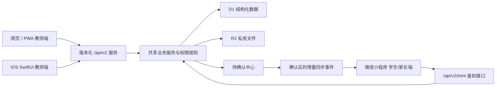

# 微信小程序、iOS 与中国大陆访问清单

更新日期：2026-08-11

## 当前实际状态

- [x] 已购买 `daofazuoye.cn`，用户已确认腾讯云域名命名/实名审核通过；注册期至 2027-08-11。
- [x] 仓库已统一配置 `https://daofazuoye.cn`，网站、小程序和 iOS 不再引用旧
  `chatgpt.site` 地址。
- [x] PWA、iOS SwiftUI 工程、小程序学生/家长边界和三端共享 API 已完成本地实现。
- [x] 小程序已包含作业、跟读与听写、成长记录、班级资料、优秀示范和家校消息；家校
  消息支持教师审批发布、打开已读和“我已知晓”回执。
- [x] `.cn` 域名命名/实名审核已通过；DNSPod 已发布两条 A 记录和两条验证 TXT，
  Sites 自定义域、证书与 HTTPS 状态均为 `active`。
- [ ] 尚未确认 `daofazuoye.cn` 已取得“网站服务”的 ICP 备案号；此前截图中的“小程序
  已备案”不能替代网站域名 ICP 备案。
- [ ] 正式 DNS、自定义域和 HTTPS 已完成；尚待发布包含 PWA 与合规页面的新站版本，
  并在中国大陆的电信、联通、移动网络分别实测。可运行 `npm run release:live:check`
  生成只读体检报告。
- [ ] 尚未配置微信后台服务器域名、生产 AppSecret、体验版二维码和真机矩阵。
- [x] 已生成不透明 1024×1024 iOS AppIcon 并接入 Xcode 资产目录。
- [ ] 尚未完成 Mac/Xcode 签名和 TestFlight 真机验收。

## 现在最简单的手机使用方式

优先使用 PWA，不需要应用商店，也不需要重新开发一套数据：

1. 在 iPhone 的 Safari 打开正式 HTTPS 网站并登录。
2. 点“分享” → “添加到主屏幕” → 勾选“作为网页 App 打开”。
3. 以后直接点“知师研室”图标，默认进入 `/v2/record`。
4. 弱网时输入会留在本机；断网重新打开会进入离线记录页，联网后自动同步。

Apple 官方操作说明：<https://support.apple.com/zh-cn/guide/iphone/iph42ab2f3a7/ios>

## 中国大陆访问建议

### 内部测试

- 可先继续使用当前 HTTPS 测试地址，并把 `/install` 发到自己的微信收藏。
- iPhone 从 Safari 添加到主屏幕；微信内置浏览器不能直接完成 iOS 主屏幕安装。
- 当前 Cloudflare/Sites 测试地址只用于内测，不承诺中国大陆网络质量，也不能直接
  作为正式小程序服务器域名。

### 正式长期使用

- [x] 已购买简短自有域名 `daofazuoye.cn`，不再依赖平台二级域名。
- [x] 已执行 `npm run release:domain -- daofazuoye.cn`；网站、小程序和 iOS 已同步为
  `https://daofazuoye.cn`。
- [x] 域名无 `ServerHold`；DNS、Sites 自定义域和自动 HTTPS 证书均已生效。
- [x] 已增加 `npm run release:live:check`，检查 NS、A/AAAA/CNAME、HTTP 跳转、HTTPS、
  PWA 清单和会话接口；报告写入 `.artifacts/release/live-readiness.md`。
- [ ] 若正式服务放在腾讯云等中国大陆节点，需为 `daofazuoye.cn` 完成网站 ICP 备案或
  接入备案，并保持备案主体、域名和实际接入服务一致。
- [ ] 可信 HTTPS 证书和 HTTP→HTTPS 跳转已生效；尚待增加至少两个地区的可用性监测。
- [x] 个人低流量默认只使用一个正式地址 `https://daofazuoye.cn`；三个客户端的
  API 都位于该地址的 `/api/v2/*`，不额外维护 `api` 子域名和跨域规则。
- [ ] 在大陆环境实测登录、上传、AI 调用、私有文件下载和弱网同步；不能只测试首页。

当前最低成本方案是继续使用 Cloudflare 全球网络并绑定自有域名：Workers 自定义域可
自动创建 DNS 记录和签发证书，但这不等同于 Cloudflare 中国网络。Cloudflare 官方说明
中国网络是 Enterprise 独立订阅，因此个人低预算不应把它列为默认方案：
<https://developers.cloudflare.com/workers/configuration/routing/custom-domains/>、
<https://developers.cloudflare.com/china-network/>。

如果大陆移动网络实测不稳定，再选择腾讯云中国大陆轻量服务器/其他备案接入服务并迁移
后端；不要仅增加一层大陆反向代理后仍把全部 D1/R2 请求发往境外，那不会真正消除跨境
链路。腾讯云官方备案流程：<https://cloud.tencent.com/document/product/243/18909>。

微信官方要求小程序通讯域名预先配置、使用 HTTPS、不能用 IP/localhost，并且域名
必须完成 ICP 备案：<https://developers.weixin.qq.com/miniprogram/dev/framework/ability/network.html>

若希望少维护服务器，可评估微信云托管；它能让小程序通过私有协议调用服务而无需
配置普通通讯域名，但当前 D1/R2 服务需要单独迁移和回归，不能直接切换。

## 需要你准备的微信小程序资料

### 账号和主体

- [ ] 已认证的小程序主体；确认使用个人、个体工商户或企业主体。
- [x] 正式 AppID 已写入微信开发者工具工程配置。
- [ ] 小程序管理员微信与可扫码登录的开发成员账号。
- [ ] AppSecret：只写入 Cloudflare/托管平台 Secret，**不要再发到聊天、截图或代码库**。
- [ ] 小程序名称、简称、简介、服务类目和客服电话/邮箱。

### 域名和后端

- [ ] 已备案的 HTTPS 正式域名。
- [ ] 在“小程序后台 → 开发 → 开发设置 → 服务器域名”配置 `request`、`uploadFile`、
  `downloadFile` 合法域名，三项都填网站正式地址；不要写端口或接口路径，也不要填写
  `api.weixin.qq.com`。
- [ ] 后端环境变量：`WECHAT_APP_ID`、`WECHAT_APP_SECRET`；体验环境保持
  `MINI_FEATURE_ENABLED=false`，通过整体验收后生产才改为 `true`。
- [ ] R2 私有文件只能经过 `/api/v2/mini/files/*` 鉴权读取。

### 隐私和内容

- [ ] 隐私政策、用户协议、注销/停用说明和帮助支持页面已在本地完成；发布新站版本后
  分别使用 `/privacy`、`/terms`、`/account-deletion`、`/support`。尚需莫老师确认对外
  联系方式。
- [ ] 在微信后台填写《小程序用户隐私保护指引》。当前功能涉及微信登录标识、学生/
  家长绑定、相册或文件选择、作业附件上传、学习记录与设备网络信息。
- [ ] 明确学生姓名、联系方式、学校等字段的用途、保存期限、删除方式和外部 AI 处理边界。
- [ ] 准备未成年人监护人同意说明；家长只能查看已绑定孩子且教师确认的内容。

微信官方隐私开发指南：<https://developers.weixin.qq.com/miniprogram/dev/framework/user-privacy/PrivacyAuthorize.html>

### 设计素材

- [ ] 1024×1024 无透明边的主图标，以及微信要求的裁切版本。
- [ ] 8–10 张真实功能截图：作业、提交、订正、听写、成长、班级资料、家校消息回执、
  教师确认记录和多孩子切换。
- [ ] 加载页、空状态、网络错误、登录过期和隐私授权文案。

### 真机与体验版

- [ ] 一台能运行微信开发者工具的 Windows 或 Mac 电脑，并提供微信 CLI 路径。
- [ ] 将测试微信号加入体验成员；准备学生、单孩子家长、多孩子家长三个账号。
- [ ] 至少 2 台 Android、2 台 iPhone、1 台平板。
- [ ] 分别测试 Wi‑Fi、4G/5G、弱网、上传中断、重复提交、会话停用和私有文件越权。
- [ ] 本轮只生成体验版二维码；验收记录完整后才提交正式审核。

## 需要你准备的 iOS 资料

- [ ] 一台可运行当前 Xcode 的 Mac；Windows 不能完成 iOS 签名或上机安装。
- [ ] Apple Developer Program 账号和已接受协议的 Team；官方个人/组织会员年费目前为
  99 美元：<https://developer.apple.com/cn/programs/>
- [ ] 唯一 Bundle ID，当前占位为 `cn.zhishiyan.mobile`。
- [ ] App 名称、副标题、描述、关键词、支持 URL、隐私政策 URL和联系邮箱。
- [x] 1024×1024 不透明 AppIcon 已完成。
- [ ] 6.7 英寸 iPhone、6.5 英寸 iPhone 和 iPad 截图。
- [ ] App Store 隐私问卷：账号标识、教育数据、用户内容、诊断数据及其是否关联身份。
- [ ] TestFlight 内部测试成员；外部测试需要 Beta App Review。Apple 官方说明支持最多
  10,000 名外部测试者。

仓库内已提供 `ios/project.yml` 和 SwiftUI 源码。在 Mac 上用 XcodeGen 生成工程，填写
实际 HTTPS 域名、Team、Bundle ID 和 AppIcon 后即可进行模拟器、真机和 TestFlight 验收。

## 三端数据互通方式

- 网页和 iOS 使用同一教师账号、同一移动记录 ID、版本号和 `operationId`。
- 本机离线队列只是临时副本；D1 是同步成功后的权威数据源。
- 网页和 iOS 都使用版本号检测跨设备并发修改；冲突内容会留在本机，可另存为新记录，
  不会把较新的服务器版本静默覆盖。
- 小程序不读取教师草稿。只有教师审批后的记录、反馈、作业和建议才进入学生/家长视图。
- 移动记录同步事件按教师选择的 `student / parent / both` 限定接收角色；本地端到端验收
  会同时使用学生和家长会话，确保“仅学生”内容不会下发家长。
- [x] 本地真实链路已验证：iOS 来源创建 → 网页读取 → 提交待确认 → 主教师批准 →
  小程序按角色增量同步；重复批准保持一条事件。
- 所有附件只存 R2，D1 保存所有权和业务关联；三端都通过鉴权接口读取。

## 一键就绪检查

运行 `npm run mobile:check` 会生成 `.artifacts/mobile/readiness.md` 和 `readiness.json`；
运行 `npm run release:live:check` 会生成 `.artifacts/release/live-readiness.md` 和 JSON 证据。
本地代码缺项会让命令失败；备案域名、微信密钥、开发者工具、Mac 签名、AppIcon 和
真机矩阵会明确显示为外部待准备条件。需要在发布机器把外部条件也设为强门禁时，执行
`node scripts/mobile-readiness.mjs --strict-external`。检查不会部署、上传或提交审核。
